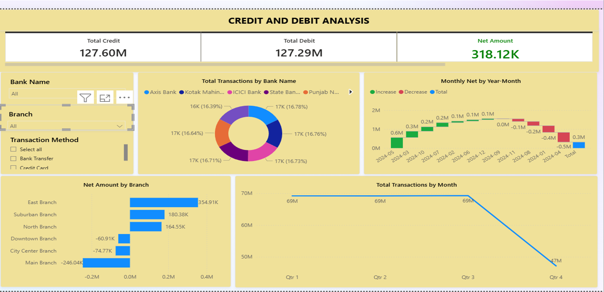

# 🏦 Banking Data Analytics Project

> **Transforming raw banking data into actionable risk and performance insights using SQL, Excel, Power BI, and Tableau.**

👤 **Author:** Shubhankar Gite  
---

## Problem Statement

Banks generate massive volumes of transactional and loan data daily, yet extracting meaningful risk and performance insights remains a challenge. This project simulates a real-world banking analytics workflow — analyzing **65,000+ loan accounts** and **millions in transaction value** to identify risk patterns, customer behavior, and disbursement trends that support data-driven decision-making.

---

## 📊 Project Overview

| Layer | Tool | Dataset | Skills Demonstrated |
|---|---|---|---|
| Data Exploration | SQL (MySQL) | Bank Transactions | Window functions, aggregations, subqueries |
| Transaction Dashboard | Power BI | Debit & Credit Data | DAX, data modeling, interactive visuals |
| Loan Risk Dashboard | Excel | Bank Loan Data | Pivot tables, slicers, conditional formatting |
| Loan Performance Dashboard | Tableau | Bank Loan Data | Calculated fields, filters, KPI design |

---

## 🗃️ SQL Analysis (`Banking_SQL_Analysis_Project.sql`)

Wrote **20+ optimized SQL queries** on the `bank_transactions` table to surface transaction-level and customer-level insights.

### Basic Metrics
- Total transaction count and money flow
- Debit vs. Credit distribution
- Branch-wise transaction volume
- Monthly transaction trends

### Customer Analysis
- Top 10 customers by transaction value
- Most active customers by transaction count
- Customers with balance above the overall average
- Most recent transaction per customer

### Filtered Business Rules
- High-value transactions above ₹50,000
- Branches exceeding ₹50 Lakh in total volume
- Customers with more than 20 transactions
- Customers with cumulative spend above ₹1 Lakh

### Advanced Analytics
- Debit vs. Credit percentage contribution
- Running totals per customer using **Window Functions (`SUM OVER PARTITION BY`)**
- Monthly growth trend analysis
- Bank-wise and transaction method usage breakdowns

---

## 📉 Dashboard 1 — Credit & Debit Analysis (Power BI)

**Key Metrics:**
| Metric | Value |
|---|---|
| Total Credit | ₹127.60M |
| Total Debit | ₹127.29M |
| Net Amount | ₹318.12K |

**Visuals:** Bank-wise transaction share · Monthly net waterfall · Branch-wise net amount · Quarterly transaction trend

**💡 Business Impact:**
- Detected a sharp **Q4 transaction drop** from ₹69M to ₹47M, signaling potential seasonal risk or customer churn
- Identified **Main Branch** as the only branch with a significant net negative (−₹246K), warranting operational review
- Confirmed near-equal distribution across 6 banks (~16–17% each), indicating no single bank dependency

---

## 📉 Dashboard 2 — Bank Loan Portfolio Risk (Excel)

**Key Metrics:**
| Metric | Value |
|---|---|
| Total Loan Amount | ₹751M |
| Loan Count | 65,535 |
| Delinquent Rate | 11% |
| Default Rate | 2% |
| NPA Amount | ₹11.23M |

**Visuals:** Grade-wise accounts · State-wise loan distribution · Loan status donut · Delinquent vs Default bar · Monthly disbursement trend

**💡 Business Impact:**
- Pinpointed **Uttar Pradesh** as the highest-exposure state at ₹10.06 Cr, enabling targeted regional risk monitoring
- Flagged **5,706 delinquent accounts** vs. 418 default accounts — a 13.6x ratio indicating a large at-risk pipeline before default
- Disbursement peak in **March (₹12.38 Cr)** followed by sharp decline — useful for cash flow and provisioning forecasts

---

## 📉 Dashboard 3 — Bank Loan Performance Risk (Tableau)

**Key Metrics:**
| Metric | Value |
|---|---|
| Total Loans | 39,717 |
| Loan Amount | ₹445.60M |
| Total Interest | ₹2,661.35M |
| Total Collection | ₹482.70M |
| Default Rate | 2.57% |
| Delinquent Rate | 10.86% |

**Visuals:** Grade-wise default rate · Loan status distribution · Age group loan breakdown · State-wise revenue · Monthly disbursement trend

**💡 Business Impact:**
- Ranked **Grade E as the highest-risk segment** (2.96% default rate), supporting credit policy tightening for lower-grade borrowers
- Found the **26–35 age group** drives the most loan volume (₹198.52M) — key target demographic for retention and upsell
- **April disbursement spike (₹86.46M)** followed by a mid-year slump suggests seasonal lending patterns worth optimizing

## 🚀 How to Run This Project

1. **SQL Analysis**
   - Import `Debit_and_Credit_banking_data.xlsx` into MySQL as the `bank_transactions` table
   - Execute `Banking_SQL_Analysis_Project.sql` in sequence

2. **Excel Dashboard**
   - Open `Bank_Loan_Data_Analytics.xlsx` and navigate to the Dashboard sheet
   - Use slicers to filter by year, grade, and loan status

3. **Power BI Dashboard**
   - Connect `Debit_and_Credit_banking_data.xlsx` as the data source
   - Refresh and explore using Bank Name, Branch, and Transaction Method filters

4. **Tableau Dashboard**
   - Connect `Bank_Loan_Data_Analytics.xlsx`
   - Use Disbursement Date and Religion filters for sliced views

---

## 💡 Key Insights Summary

| # | Insight | Business Impact |
|---|---|---|
| 1 | Grade E loans have the highest default rate (2.96%) | Prioritize risk controls for lower-grade lending |
| 2 | 5,706 delinquent accounts form a large pre-default pipeline | Early intervention can reduce NPA growth |
| 3 | UP & Punjab account for the bulk of loan disbursements | Geographic concentration risk to monitor |
| 4 | Q4 transaction volume dropped sharply from ₹69M to ₹47M | Investigate churn or seasonal demand factors |
| 5 | Age group 26–35 drives the highest loan volume (₹198.52M) | Key segment for product design and retention |

⭐ *If you found this project useful, consider giving it a star!*
